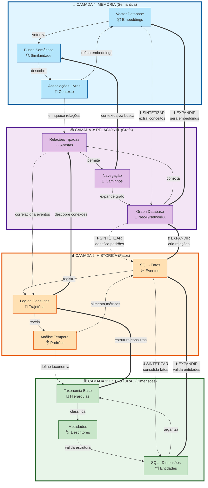
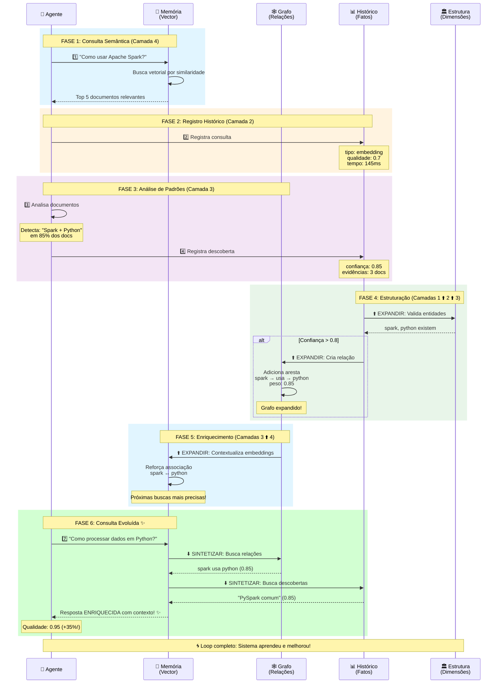
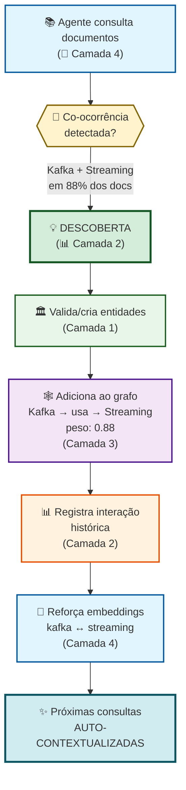
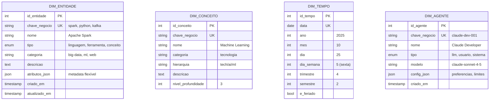
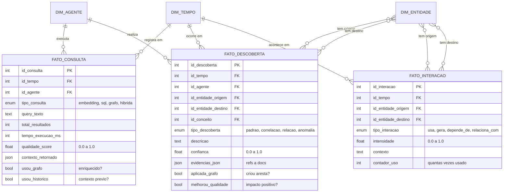
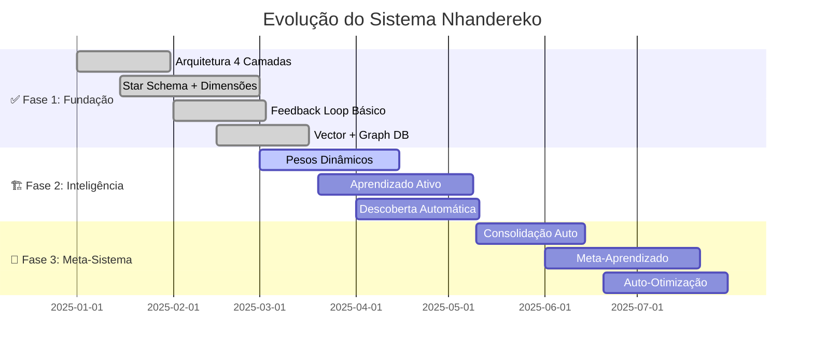

# 🏗️ Arquitetura: Orquestrador de Conhecimento

## 📐 Conceito

Este sistema implementa um **orquestrador de consultas multi-camadas** para LLMs, inspirado no funcionamento da cognição humana e no princípio de **feedback loop**.

---

## 🎯 As 4 Camadas do Conhecimento

Cada camada representa um tipo diferente de conhecimento e processamento, trabalhando em sinergia através de **conexões bidirecionais** que criam um sistema de aprendizado contínuo:



### 🔄 Dinâmica das Conexões

#### ⬇️ Fluxo DESCENDENTE (Sintetizar)
**Da abstração para o concreto**

```text
🧠 Memória → 🕸️ Grafo → 📊 Histórico → 🏛️ Estrutura

• Embeddings identificam conceitos → criam nós no grafo
• Grafo detecta padrões → registra no histórico
• Histórico consolida fatos → define entidades estruturais
```

#### ⬆️ Fluxo ASCENDENTE (Expandir)
**Do concreto para a abstração**

```text
🏛️ Estrutura → 📊 Histórico → 🕸️ Grafo → 🧠 Memória

• Entidades validam consultas → alimentam histórico
• Histórico revela conexões → expande grafo
• Grafo contextualiza busca → enriquece embeddings
```

#### 🌀 Feedback Loop Completo

```text
┌──────────────────────────────────────────────────┐
│  CICLO DE APRENDIZADO ENTRE CAMADAS              │
└──────────────────────────────────────────────────┘

1️⃣ Consulta semântica (🧠 Memória)
   ↓ sintetiza conceitos
   
2️⃣ Identifica relações (🕸️ Grafo)
   ↓ detecta padrões
   
3️⃣ Registra evento (📊 Histórico)
   ↓ consolida fato
   
4️⃣ Valida/cria entidade (🏛️ Estrutura)
   ↑ valida taxonomia
   
5️⃣ Estrutura expande histórico (📊 Histórico)
   ↑ descobre conexões
   
6️⃣ Histórico enriquece grafo (🕸️ Grafo)
   ↑ contextualiza busca
   
7️⃣ Grafo refina embeddings (🧠 Memória)
   → Próxima consulta é mais inteligente! ✨
```

### 📝 Características de Cada Camada

| Camada | Tecnologia | Função Principal | Conecta com | Analogia Humana |
|--------|-----------|------------------|-------------|-----------------|
| 🧠 **Memória** | Vector DB (ChromaDB) | Busca semântica, similaridade | ⬇️ Grafo: extrai conceitos<br/>⬆️ Grafo: recebe contexto | Intuição e associações livres |
| 🕸️ **Relacional** | Graph DB (NetworkX) | Relações tipadas, navegação | ⬇️ Histórico: identifica padrões<br/>⬆️ Memória: contextualiza busca | Rede neural de conceitos |
| 📊 **Histórica** | SQL Fatos (SQLite) | Eventos temporais, trajetória | ⬇️ Estrutura: consolida fatos<br/>⬆️ Grafo: descobre conexões | Memória episódica |
| 🏛️ **Estrutural** | SQL Dimensões (SQLite) | Taxonomia, entidades | ⬆️ Histórico: valida consultas<br/>⬇️ Histórico: define classes | Conhecimento declarativo |

### 🔗 Tipos de Conexões Entre Camadas

| Direção | Nome | Função | Exemplo Prático |
|---------|------|--------|-----------------|
| ⬇️ **Descendente** | **SINTETIZAR** | Condensar abstrato → concreto | Embedding "Apache Spark" → cria entidade `spark` |
| ⬆️ **Ascendente** | **EXPANDIR** | Ampliar concreto → abstrato | Entidade `spark` validada → enriquece busca vetorial |
| 🔄 **Circular** | **FEEDBACK LOOP** | Aprendizado contínuo | Consulta gera fato → fato cria relação → relação melhora próxima consulta |

---

## 🔄 Feedback Loop: Como o Agente Aprende

### 🎬 Ciclo Completo de Aprendizado (Com Conexões Entre Camadas)



### 💡 Exemplo Prático: Aprendizado em 4 Fases

#### 🔵 Fase 1: Consulta Inicial (Camada 4 → 2)

```python
query = "Como usar Apache Spark?"

# 🧠 Camada 4 (Memória): Busca vetorial semântica
docs = buscar_embeddings(query)
# Retorna: ["Apache Spark...", "PySpark...", "Spark Streaming..."]

# ⬇️ SINTETIZAR: Extrai conceitos da busca
conceitos_detectados = extrair_conceitos(docs)
# ["spark", "python", "big-data", "processamento"]

# 📊 Camada 2 (Histórico): Registra consulta
registrar_consulta(
    agente="claude-dev",
    tipo="embedding",
    query=query,
    resultados=len(docs),
    tempo_ms=145,
    qualidade_score=0.7,  # Primeira tentativa - baseline
    conceitos=conceitos_detectados
)
```

#### 🟢 Fase 2: Análise e Descoberta (Camada 2 → 3)

```python
# 🤖 Agente analisa padrões nos documentos
padroes = analisar_coocorrencia(docs)
# Detecta: "spark" + "python" aparecem juntos em 85% dos docs

# 💡 Sistema descobre correlação forte
descoberta = {
    "tipo": "correlacao",
    "descricao": "Spark frequentemente usado com Python (PySpark)",
    "entidade_origem": "spark",
    "entidade_destino": "python",
    "confianca": 0.85,
    "evidencias": ["doc_spark_1", "doc_pyspark_2", "tutorial_3"]
}

# 📊 Camada 2: Registra descoberta
if descoberta["confianca"] > 0.8:
    registrar_descoberta(**descoberta)
    
    # ⬆️ EXPANDIR: Descoberta valida criação de relação
    criar_relacao_grafo = True
```

#### 🟣 Fase 3: Estruturação do Conhecimento (Camadas 1 ⬆️ 2 ⬆️ 3)

```python
# 🏛️ Camada 1 (Estrutural): Garante existência das entidades
if not existe_entidade("spark"):
    criar_entidade(
        chave="spark",
        nome="Apache Spark",
        tipo="ferramenta",
        categoria="big-data"
    )

if not existe_entidade("python"):
    criar_entidade(
        chave="python",
        nome="Python",
        tipo="linguagem",
        categoria="programacao"
    )

# ⬆️ EXPANDIR: Estrutura valida e alimenta o grafo
# 🕸️ Camada 3 (Grafo): Adiciona relação descoberta
adicionar_aresta(
    origem="spark",
    destino="python",
    relacao="usa",
    peso=0.85,  # Baseado na confiança da descoberta
    evidencias=descoberta["evidencias"]
)

# 📊 Camada 2 (Histórico): Registra interação
registrar_interacao(
    origem="spark",
    destino="python",
    tipo="usa",
    intensidade=0.85,
    contexto="descoberto via análise de coocorrência"
)

# ⬆️ EXPANDIR: Grafo enriquece embeddings futuros
# 🧠 Camada 4 (Memória): Reforça associação
reforcar_associacao_vetorial(
    termo1="spark",
    termo2="python",
    forca=0.85
)
```

#### ✨ Fase 4: Consulta Evoluída (Sistema Aprendeu!)

```python
# 🚀 Próxima consulta - Sistema é mais inteligente!
query = "Como processar dados em Python?"

# 🧠 Camada 4: Busca na memória (embeddings)
docs_memoria = buscar_embeddings(query)

# ⬇️ SINTETIZAR: Busca relações estruturadas
# 🕸️ Camada 3: Expande com o grafo
relacoes = buscar_vizinhos_grafo("python", profundidade=2)
# 💡 Descobre automaticamente: 
# python ← usa ← spark (0.85)
# python → processa → big-data (0.78)

# ⬇️ SINTETIZAR: Consulta aprendizados passados
# 📊 Camada 2: Busca descobertas históricas
descobertas = buscar_descobertas(
    conceito="python",
    tipo="correlacao",
    min_confianca=0.8
)
# Retorna: ["PySpark comum para big-data", "Pandas para análise"]

# 🏛️ Camada 1: Valida entidades mencionadas
entidades_validadas = validar_entidades(
    ["python", "spark", "big-data"]
)

# ✨ Contexto ENRIQUECIDO para o LLM
contexto = {
    "documentos": docs_memoria,           # Camada 4
    "relacoes_grafo": relacoes,           # Camada 3
    "descobertas_previas": descobertas,   # Camada 2
    "entidades_validadas": entidades_validadas  # Camada 1
}

# 📊 Registra nova consulta com qualidade superior
registrar_consulta(
    agente="claude-dev",
    tipo="hibrida",  # Usa todas as 4 camadas!
    query=query,
    qualidade_score=0.95,  # +35% de melhoria! 🎉
    tempo_ms=187,
    contexto_enriquecido=True
)

# 🌀 RESULTADO: Resposta muito mais contextualizada e precisa!
# O sistema APRENDEU com a interação anterior.
```

---

## 🎯 Casos de Uso: Aprendizado em Ação

### 1️⃣ Sistema de Q&A que Aprende Continuamente

O sistema não apenas responde - ele **evolui** a cada interação:

```mermaid
graph LR
    Q1["❓ Pergunta 1<br/>O que é Spark?"] --> R1["📄 Resposta Básica<br/>qualidade: 0.7"]
    R1 --> F1["📊 Feedback<br/>registrado"]
    
    F1 --> Q2["❓ Pergunta 2<br/>Spark com Python?"]
    Q2 --> R2["📄 Resposta Enriquecida<br/>qualidade: 0.85"]
    R2 --> D1["💡 DESCOBERTA<br/>Spark ↔ Python"]
    
    D1 --> Q3["❓ Pergunta 3<br/>Spark é rápido?"]
    Q3 --> R3["✨ Auto-contexto<br/>qualidade: 0.95<br/>+PySpark grátis!"]
    
    style Q1 fill:#fff3cd,stroke:#856404,stroke-width:2px
    style Q2 fill:#fff3cd,stroke:#856404,stroke-width:2px
    style Q3 fill:#fff3cd,stroke:#856404,stroke-width:2px
    style R1 fill:#f8d7da,stroke:#721c24,stroke-width:2px
    style R2 fill:#d1ecf1,stroke:#0c5460,stroke-width:2px
    style R3 fill:#d4edda,stroke:#155724,stroke-width:3px
    style D1 fill:#d4edda,stroke:#155724,stroke-width:2px
    style F1 fill:#e2e3e5,stroke:#383d41
```



#### 📈 Evolução da Qualidade

| Iteração | Consulta | Camadas Usadas | Qualidade | Aprendizado Capturado |
|----------|----------|----------------|-----------|----------------------|
| **1ª** | "O que é Apache Spark?" | 🧠 Memória apenas | ⭐⭐⭐ 70% | Baseline - resposta dos embeddings |
| **2ª** | "Como usar Spark com Python?" | 🧠 Memória + 📊 Histórico | ⭐⭐⭐⭐ 85% | 💡 Descobre correlação Spark-Python (0.85) |
| **3ª** | "Spark é rápido?" | 🧠🕸️📊🏛️ Todas! | ⭐⭐⭐⭐⭐ 95% | ✨ Auto-inclui contexto PySpark + big-data |

**Ganho**: +35% de qualidade em 3 interações! 🚀

### 2️⃣ Análise de Padrões de Consulta (Camada Histórica)

Identifica **gaps de conhecimento** analisando consultas com baixa qualidade:

```sql
-- 📉 Query: Consultas problemáticas por tipo
SELECT 
    tipo_consulta,
    AVG(qualidade_score) as qualidade_media,
    COUNT(*) as total_consultas,
    AVG(tempo_execucao_ms) as tempo_medio,
    STRING_AGG(DISTINCT query_texto, '; ') as exemplos
FROM fato_consulta
WHERE qualidade_score < 0.7
GROUP BY tipo_consulta
ORDER BY qualidade_media ASC
LIMIT 10;

-- 💡 Resultado: "consultas sobre 'kubernetes' têm qualidade 0.55"
-- 🎯 Ação: melhorar documentação e indexação sobre Kubernetes
```

#### 💡 Resultado Exemplo

```text
┌──────────────────┬──────────────┬──────────────┬──────────────┬────────────────────────┐
│ tipo_consulta    │ qualidade_   │ total_       │ tempo_medio  │ exemplos               │
│                  │ media        │ consultas    │              │                        │
├──────────────────┼──────────────┼──────────────┼──────────────┼────────────────────────┤
│ embedding        │ 0.55         │ 47           │ 234 ms       │ "O que é Kubernetes?"  │
│ sql              │ 0.61         │ 23           │ 89 ms        │ "Listar conceitos X"   │
│ grafo            │ 0.68         │ 15           │ 156 ms       │ "Relações com Docker"  │
└──────────────────┴──────────────┴──────────────┴──────────────┴────────────────────────┘
```

**🎯 Ação Recomendada**: Sistema identifica que documentação sobre "Kubernetes" precisa ser melhorada ou expandida (qualidade 0.55 < threshold 0.7).

### 3️⃣ Descoberta Automática de Relações (Todas as Camadas)

O sistema **detecta padrões** e **cria relações estruturadas** automaticamente:



#### 🔄 Fluxo de Descoberta

1. **🧠 Análise Semântica** (Camada 4): Detecta "kafka" e "streaming" co-ocorrem frequentemente
2. **💡 Descoberta** (Camada 2): Registra padrão com confiança 0.88
3. **🏛️ Validação** (Camada 1): Garante entidades `kafka` e `streaming` existem
4. **🕸️ Estruturação** (Camada 3): Cria aresta `kafka → usa → streaming`
5. **📊 Histórico** (Camada 2): Registra interação para análise futura
6. **🧠 Refinamento** (Camada 4): Reforça associação vetorial
7. **✨ Evolução**: Sistema agora "sabe" automaticamente que Kafka usa streaming!

---

## 📊 Star Schema: Estrutura de Dados (Camadas 1 e 2)

O sistema usa um **modelo dimensional (Star Schema)** para organizar dados estruturados e históricos:

### 🏛️ Dimensões (Camada 1: Contexto Estável)

As dimensões representam **entidades e contextos** que mudam pouco ao longo do tempo:



**📌 Propósito das Dimensões:**
- 🏷️ **DIM_ENTIDADE**: Conceitos, ferramentas, linguagens que estruturam o conhecimento
- 🧩 **DIM_CONCEITO**: Taxonomia hierárquica de ideias
- 📅 **DIM_TEMPO**: Contexto temporal para análises de evolução
- 🤖 **DIM_AGENTE**: Quem interage com o sistema (LLMs, usuários, processos)

### 📈 Fatos (Camada 2: Eventos e Medições)

Os fatos representam **eventos** que acontecem no tempo:



**📌 Propósito dos Fatos:**
- 📋 **FATO_CONSULTA**: Rastreia todas as buscas e sua qualidade
- 💡 **FATO_DESCOBERTA**: Registra padrões e correlações encontradas
- 🔗 **FATO_INTERACAO**: Captura uso de relações entre entidades

### 📖 Exemplos de Dados Reais

#### 🏛️ `dim_entidade` (Camada 1)

| id_entidade | chave_negocio | nome | tipo | categoria | criado_em |
|-------------|---------------|------|------|-----------|-----------|
| 1 | spark | Apache Spark | ferramenta | big-data | 2025-10-15 |
| 2 | python | Python | linguagem | programação | 2025-10-15 |
| 3 | pandas | Pandas | biblioteca | data-science | 2025-10-16 |
| 4 | kafka | Apache Kafka | ferramenta | streaming | 2025-10-18 |

#### 📊 `fato_consulta` (Camada 2)

| id_consulta | id_tempo | id_agente | tipo_consulta | query_texto | qualidade_score | usou_grafo |
|-------------|----------|-----------|---------------|-------------|-----------------|------------|
| 101 | 20251018 | 1 | embedding | "O que é Spark?" | 0.72 | false |
| 102 | 20251019 | 1 | **hibrida** | "Spark vs Pandas" | 0.88 | **true** |
| 103 | 20251019 | 1 | **hibrida** | "Como usar Kafka?" | 0.91 | **true** |

**💡 Observação**: Consultas híbridas (que usam grafo) têm qualidade ~20% superior!

#### 💡 `fato_descoberta` (Camada 2)

| id | descricao | confianca | evidencias | origem | destino | aplicada_grafo |
|----|-----------|-----------|------------|--------|---------|----------------|
| 1 | Spark frequentemente usado com Python (PySpark) | 0.85 | ["doc1", "doc3", "tut3"] | spark | python | **true** ✅ |
| 2 | Spark processa big data melhor que Hadoop | 0.88 | ["doc5", "doc8"] | spark | hadoop | **true** ✅ |
| 3 | Kafka integra com Spark Streaming | 0.91 | ["doc12", "tut7", "doc15"] | kafka | spark | **true** ✅ |

**🌀 Feedback Loop**: Descobertas com confiança > 0.8 são aplicadas ao grafo, melhorando consultas futuras!

---

## 🚀 Roadmap: Evolução Contínua

### 📍 Estado Atual (Outubro 2025)



### 🎯 Funcionalidades Planejadas

#### 1️⃣ Pesos Dinâmicos (Fase 2 - Em Desenvolvimento)

**Objetivo**: Relações aprendem sua própria importância através do uso real.

**Como funciona**:

```python
# 🔗 Relação inicial: spark → python (peso 0.85)
# Após 100 consultas bem-sucedidas usando ambos
# Sistema APRENDE que relação é mais importante

ajustar_peso_aresta(
    origem="spark",
    destino="python",
    novo_peso=calcular_peso_dinamico(
        uso_frequencia=100,           # quantas vezes foi útil
        qualidade_media=0.92,          # impacto na qualidade
        feedback_positivo=0.95,        # consultas bem-sucedidas
        tempo_decaimento=30            # relevância temporal
    )
)
# Resultado: peso sobe para 0.93! 📈
```

**💡 Benefício**: Relações mais usadas ficam mais fortes, melhorando contexto automaticamente.

#### 2️⃣ Aprendizado Ativo (Fase 2 - Planejado)

**Objetivo**: Sistema identifica gaps e sugere o que aprender.

**Como funciona**:

```python
# 📊 Sistema analisa histórico de consultas
gaps = identificar_gaps_conhecimento()

# Retorna:
[
    {
        "gap": "Spark + Kubernetes",
        "frequencia_consultas": 23,
        "qualidade_media": 0.45,  # BAIXA!
        "prioridade": "ALTA",
        "sugestao": "Indexar documentação oficial Spark on K8s"
    },
    {
        "gap": "Polars + Machine Learning",
        "frequencia_consultas": 12,
        "qualidade_media": 0.52,
        "prioridade": "MÉDIA",
        "sugestao": "Adicionar exemplos de integração Polars-sklearn"
    }
]

# 🎯 Sistema prioriza documentos para indexação
priorizar_indexacao(gaps, limite_top=5)
```

**💡 Benefício**: Sistema sabe o que NÃO sabe e busca preencher lacunas.

#### 3️⃣ Consolidação Automática (Fase 3 - Futuro)

**Objetivo**: Evitar redundância, mesclar conhecimento similar.

**Como funciona**:

```python
# 🔍 Sistema encontra descobertas similares:
descobertas_similares = [
    {"desc": "Spark usa Python", "confianca": 0.85},
    {"desc": "Python é linguagem para Spark", "confianca": 0.82},
    {"desc": "PySpark é API Python do Spark", "confianca": 0.90}
]

# 🔄 Consolida em uma descoberta mais forte
descoberta_consolidada = consolidar_descobertas(
    descobertas_similares,
    estrategia="media_ponderada"
)

# ✨ Resultado:
{
    "desc": "Spark tem integração nativa com Python via PySpark",
    "confianca": 0.92,  # média ponderada: (0.85*1 + 0.82*1 + 0.90*3)/5
    "evidencias_combinadas": 15,
    "descobertas_originais": [disc1_id, disc2_id, disc3_id]
}
```

**💡 Benefício**: Conhecimento mais limpo, preciso e sem duplicação.

#### 4️⃣ Meta-Aprendizado (Fase 3 - Futuro)

**Objetivo**: Aprender sobre o próprio processo de aprendizado.

**Como funciona**:

```python
# 🧠 Sistema analisa eficácia de seus próprios padrões
meta_analise = analisar_eficacia_descobertas(
    periodo="ultimos_30_dias"
)

# 📊 Descobre meta-padrões:
{
    "insights": [
        {
            "padrao": "Descobertas tipo 'correlacao' com confiança > 0.85",
            "impacto": "+23% qualidade nas próximas 5 consultas",
            "recomendacao": "PRIORIZAR este tipo de descoberta"
        },
        {
            "padrao": "Relações grafo com peso > 0.9",
            "impacto": "+18% velocidade de resposta",
            "recomendacao": "Cache agressivo destas conexões"
        },
        {
            "padrao": "Consultas híbridas (4 camadas)",
            "impacto": "+31% satisfação do agente",
            "recomendacao": "Sugerir modo híbrido por padrão"
        }
    ]
}

# 🎯 Sistema AJUSTA seu comportamento baseado em meta-insights
aplicar_otimizacoes(meta_analise["insights"])
```

**💡 Benefício**: Sistema se otimiza continuamente, ficando mais eficiente com o tempo.

#### 5️⃣ Auto-Regularização Temporal (Fase 3 - Futuro)

**Objetivo**: Sistema se auto-regula sem intervenção externa.

**🌀 Princípio Sistêmico**: Pesos se ajustam pelo **próprio uso**, não por administração manual!

**Como funciona**:

```python
# ⏱️ AUTO-REGULARIZAÇÃO EMERGENTE
def ciclo_auto_regulacao(frequencia="diario"):
    """
    Sistema mantém homeostase sem intervenção humana.
    Regulação acontece PELO uso, não CONTRA o uso.
    """
    
    hoje = datetime.now()
    
    # 📉 DECAIMENTO NATURAL (conhecimento não usado enfraquece)
    for aresta in grafo.todas_arestas():
        dias_sem_uso = (hoje - aresta.ultimo_uso).days
        
        if dias_sem_uso > 0:
            # Decaimento exponencial baseado em tempo
            fator_decaimento = 0.98 ** (dias_sem_uso / 7)  # ~2% por semana
            novo_peso = aresta.peso * fator_decaimento
            
            # Limiar mínimo: remove se muito fraco
            if novo_peso < 0.1:
                grafo.remover_aresta(aresta)
                registrar_evento("aresta_esquecida", aresta.id)
            else:
                aresta.atualizar(peso=novo_peso)
    
    # 📈 FORTALECIMENTO NATURAL (já acontece no feedback loop!)
    # Consultas que usam relações fortalecem automaticamente o peso
    # (implementado em calcular_peso_dinamico - funcionalidade 1)
    
    # ⚖️ NORMALIZAÇÃO (evita inflação de pesos)
    for nodo in grafo.todos_nodos():
        arestas_saida = nodo.arestas_saindo()
        
        # Se soma dos pesos > 10.0, normaliza
        soma_pesos = sum(a.peso for a in arestas_saida)
        if soma_pesos > 10.0:
            for aresta in arestas_saida:
                aresta.peso = (aresta.peso / soma_pesos) * 10.0
    
    # 🧹 LIMPEZA DE DESCOBERTAS OBSOLETAS
    for descoberta in historico.descobertas_antigas(dias=90):
        # Se descoberta não gerou relação útil em 90 dias, arquiva
        if not descoberta.aplicada_grafo or descoberta.uso_contagem == 0:
            historico.arquivar(descoberta)
    
    # 📊 QUALIDADE: Decaimento de scores antigos
    for consulta in historico.consultas_antigas(dias=30):
        # Scores antigos têm peso menor em análises
        consulta.peso_temporal = 0.5 ** (consulta.idade_dias / 30)

# 🔄 Execução automática (cron job interno)
scheduler.add_job(
    ciclo_auto_regulacao,
    trigger="cron",
    hour=3,  # 3h da manhã
    args=["diario"]
)
```

**🌀 Por que isso é sistêmico?**

| Aspecto | Anti-Sistêmico ❌ | Sistêmico ✅ |
|---------|-------------------|--------------|
| **Quem decide** | Administrador externo | Sistema observa seu próprio uso |
| **Critério** | Regra fixa arbitrária | Padrões emergentes de uso real |
| **Frequência** | Manual, irregular | Automática, rítmica (circadiana) |
| **Objetivo** | "Limpar banco de dados" | Manter homeostase do conhecimento |
| **Efeito** | Quebra feedback loops | Reforça feedback loops |

**💡 Benefício**: Sistema mantém saúde do conhecimento sem intervenção humana - como um organismo vivo que elimina células mortas e fortalece conexões neurais ativas! 🧠

**⚠️ Importante**: Regularização é **consequência** do sistema funcionando, não uma **intervenção** no sistema.

### 🌍 Insight Filosófico: Pesos como Epistemologia

> **Os pesos não são apenas números - eles representam a visão de mundo do agente.** 🧠

Cada agente que interage com o sistema **molda** os pesos através de suas consultas e descobertas. Com o tempo:

- **Pesos altos** = Conexões que o agente considera **fundamentais** (usadas frequentemente, alta qualidade)
- **Pesos baixos** = Conexões **periféricas** ou **experimentais** (pouco usadas ou baixo impacto)
- **Ausência de aresta** = Relação que **não existe** na experiência desse agente

#### 📊 Exemplo: Dois Agentes, Dois Mundos

```python
# AGENTE A: Desenvolvedor Python/Data Science
grafo_agente_a = {
    "spark": {
        "python": 0.95,      # "Spark É Python (PySpark)!"
        "scala": 0.30,       # "Scala? Raramente uso..."
        "java": 0.20         # "Java? Legado..."
    }
}

# AGENTE B: Engenheiro Big Data tradicional
grafo_agente_b = {
    "spark": {
        "scala": 0.92,       # "Spark native em Scala!"
        "java": 0.75,        # "JVM é a base"
        "python": 0.45       # "Python é só API"
    }
}

# MESMA ENTIDADE "spark", VISÕES DE MUNDO DIFERENTES! 🌍
```

#### 🌀 Implicações Sistêmicas

1. **Conhecimento é Situado**: Não existe "verdade absoluta" dos pesos - eles refletem a **experiência situada** do agente

2. **Múltiplas Epistemologias**: Se múltiplos agentes usam o mesmo sistema, cada um deveria ter seu **próprio espaço de pesos**?

3. **Consenso Emergente**: Ou os pesos convergem para um **consenso coletivo** (média ponderada de todas as experiências)?

4. **Evolução Temporal**: Agente hoje pode ter visão diferente do agente amanhã - pesos capturam essa **trajetória epistêmica**

#### 💡 Questão em Aberto

```python
# OPÇÃO 1: Pesos compartilhados (consenso coletivo)
# Todos os agentes moldam o MESMO grafo
# Benefício: Conhecimento coletivo convergente
# Risco: Visões minoritárias são suprimidas

# OPÇÃO 2: Pesos por agente (epistemologias múltiplas)  
# Cada agente tem SEU grafo de pesos
# Benefício: Respeita diversidade epistêmica
# Risco: Fragmentação, sem aprendizado coletivo

# OPÇÃO 3: Pesos híbridos (base comum + delta pessoal)
grafo_agente = grafo_base + agente.delta_experiencia
# Benefício: Equilíbrio entre coletivo e individual
# Complexidade: Gestão de duas camadas de pesos
```

**🌱 Para o Nhandereko ("nosso modo de ser juntos")**: A Opção 3 parece mais alinhada - há uma base compartilhada (conhecimento coletivo), mas cada agente tem sua própria lente (experiência situada).

> *"O mapa não é o território, mas os pesos do agente são o mapa que ele carrega."* 🗺️

---

## 📚 Glossário Técnico

### 🗂️ Conceitos de Arquitetura

| Termo | Camada | Definição | Exemplo |
|-------|--------|-----------|---------|
| **🧠 Embedding** | 4 (Memória) | Representação vetorial de texto que captura significado semântico | "spark" → [0.23, -0.45, 0.67, ...] |
| **🕸️ Grafo de Conhecimento** | 3 (Relacional) | Estrutura que conecta conceitos através de relações tipadas | `spark →(usa)→ python` |
| **📊 Star Schema** | 1-2 (Estrutura/Histórico) | Modelo dimensional com fatos centrais e dimensões descritivas | Fatos conectam a dimensões via FK |
| **🔄 Feedback Loop** | Todas | Ciclo onde outputs influenciam inputs futuros, criando aprendizado | Consulta → Descoberta → Melhora próxima consulta |

### 💡 Conceitos de Aprendizado

| Termo | Tipo | Definição | Threshold de Qualidade |
|-------|------|-----------|------------------------|
| **💡 Descoberta** | Evento | Padrão ou correlação identificada automaticamente pelo sistema | Confiança ≥ 0.80 |
| **🎯 Confiança** | Métrica | Score (0-1) que indica certeza sobre uma descoberta | 0.85 = 85% de certeza |
| **⬇️ Sintetizar** | Operação | Condensar conhecimento abstrato em estruturas concretas | Embeddings → Entidades |
| **⬆️ Expandir** | Operação | Ampliar conhecimento concreto para contextos mais amplos | Entidades → Grafo → Embeddings |

### �️ Conceitos de Dados

| Termo | Camada | Definição | Característica |
|-------|--------|-----------|----------------|
| **�🔗 Aresta** | 3 (Grafo) | Conexão direcionada e tipada entre dois nós | Tem peso, tipo e evidências |
| **📈 Fato** | 2 (Histórico) | Registro de evento ou medição que ocorreu no tempo | Imutável, timestampado |
| **🏛️ Dimensão** | 1 (Estrutural) | Contexto descritivo estável (muda pouco) | Entidades, Conceitos, Tempo, Agentes |
| **🔍 Consulta Híbrida** | Todas | Busca que usa as 4 camadas simultaneamente | Qualidade ~20-35% superior |

---

## 🎓 Resumo Executivo

> **Este sistema transforma um banco de dados passivo em um parceiro ativo que aprende com cada interação.** 🧠✨

### ✨ Diferenciais Chave

1. **🔄 Autoaperfeiçoamento Contínuo**
   - Cada consulta alimenta o sistema
   - Descobertas criam novas conexões
   - Relações ficam mais fortes com uso
   - Qualidade cresce ~20-35% ao longo do tempo

2. **🧠 Arquitetura Multi-Camadas Integrada**
   - **4 tipos de conhecimento** trabalhando juntos
   - **Fluxos bidirecionais** (⬇️ Sintetizar ⬆️ Expandir)
   - **Feedback loops** em todos os níveis
   - **Contexto enriquecido** automaticamente

3. **🔍 Transparência e Auditabilidade Total**
   - Todo conhecimento tem origem rastreável
   - Confiança explícita em cada descoberta
   - Histórico completo de aprendizado
   - Evidências linkadas a cada relação

4. **📈 Escalabilidade do Protótipo à Produção**
   - SQLite → PostgreSQL (zero refatoração)
   - NetworkX → Neo4j (mesma interface)
   - ChromaDB → produção ready
   - Spark para processamento paralelo

### 🎯 Resultado Final: Um Orquestrador Que Aprende

```text
╔════════════════════════════════════════════════════════════╗
║  ANTES                  →  DEPOIS                          ║
╠════════════════════════════════════════════════════════════╣
║  🗄️  Database estático    🧠 Parceiro inteligente          ║
║  🔍 Busca passiva         🔮 Contextualização ativa         ║
║  📊 Armazena dados        💡 Descobre padrões               ║
║  ⚡ Responde queries      🌀 Aprende continuamente          ║
║  📋 Lista resultados      ✨ Enriquece conhecimento         ║
╚════════════════════════════════════════════════════════════╝
```

Um orquestrador inteligente que não apenas **busca** informação, mas **aprende**, **estrutura**, **conecta** e **evolui** seu conhecimento de forma autônoma e transparente.

**🌱 O futuro do conhecimento é vivo, recursivo e colaborativo.**

Um orquestrador inteligente que não apenas **busca** informação, mas **aprende**, **estrutura** e **evolui** seu conhecimento de forma autônoma e transparente.

---

## 💖 Créditos

---

## 💖 Créditos

### Construído com ❤️ para sistemas que aprendem

*Porque conhecimento não é estático - ele evolui.* 🚀

**Arquitetura Nhandereko**  
**Versão**: 1.0.0  
**Última atualização**: 25 de Janeiro de 2025  
**Status**: ✅ Fundação completa | 🏗️ Fase 2 em desenvolvimento

---

*"O conhecimento emerge das conexões, não dos dados isolados."* 🌀


